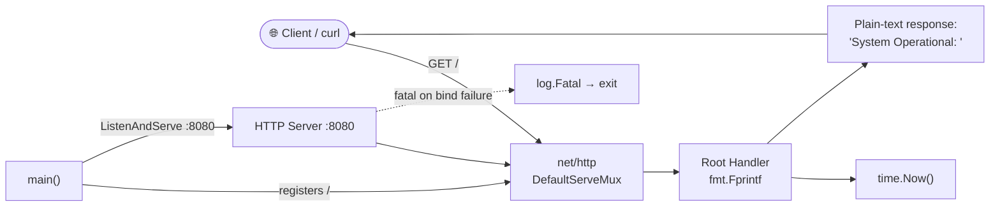
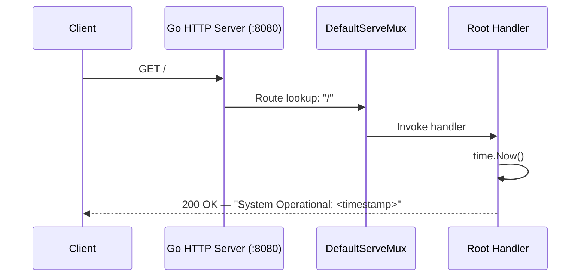
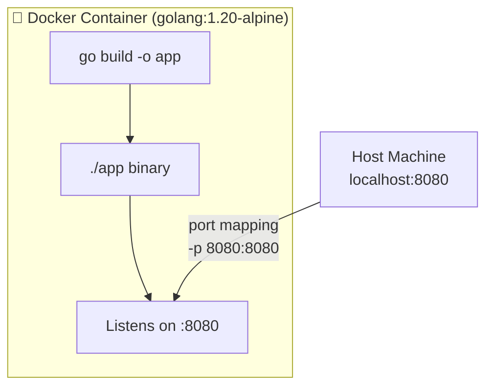

# Finance CBDC Ledger Prototype


> A lightweight Go-based HTTP service serving as the foundational scaffold for a Central Bank Digital Currency (CBDC) ledger system. Built with zero external dependencies and fully containerized for instant deployment.

---

## 📋 Overview

| Attribute | Detail |
|---|---|
| **Language** | Go 1.20 |
| **Module** | `github.com/Shivay00001/finance-cbdc-ledger-prototype` |
| **Dependencies** | None (Go standard library only) |
| **Entrypoint** | `main.go` |
| **Default Port** | `8080` |
| **Containerization** | Docker (`golang:1.20-alpine`) |
| **License** | VisionQuantech Custom Commercial License (see [LICENSE](LICENSE)) |

---

## 🏗️ Architecture & How It Works

The application is a single-binary Go service defined entirely in `main.go`. Its behavior is composed of three stages:

### 1. Startup & Handler Registration

On launch, `main()` registers a single HTTP handler against the root path (`/`) using Go's built-in `net/http` package and its `DefaultServeMux`:

```go
http.HandleFunc("/", func(w http.ResponseWriter, r *http.Request) {
    fmt.Fprintf(w, "System Operational: %s", time.Now())
})
```

### 2. Request Handling

Every incoming HTTP request to `/` is dispatched by the mux to the root handler, which:

1. Captures the current server time via `time.Now()`.
2. Writes a plain-text response to the `http.ResponseWriter`:
   ```
   System Operational: 2026-01-01 12:00:00.000000000 +0000 UTC
   ```

This endpoint functions as a liveness / health probe for the service.

### 3. Server Lifecycle

```go
log.Println("Starting high-performance service on :8080")
log.Fatal(http.ListenAndServe(":8080", nil))
```

- The server binds to port **8080** and serves requests concurrently (one goroutine per connection, per Go's standard `net/http` model).
- Startup is announced via the standard `log` package.
- If binding fails (e.g., port already in use), `log.Fatal` prints the error and terminates the process with a non-zero exit code — which also signals container orchestrators to restart the pod/container.

### Component Diagram



### Request Lifecycle



### Container Topology



---

## 🚀 Running Locally (Without Docker)

Requires **Go 1.20+**:

```bash
git clone https://github.com/Shivay00001/finance-cbdc-ledger-prototype.git
cd finance-cbdc-ledger-prototype
go build -o app
./app
```

Verify the service:

```bash
curl http://localhost:8080/
# → System Operational: 2026-01-01 12:00:00.000000000 +0000 UTC
```

---

## 🐳 Running with Docker

The included `Dockerfile` uses the `golang:1.20-alpine` base image, copies the source tree, compiles the binary, and executes it as the container's entrypoint.

### Build the image

```bash
docker build -t finance-cbdc-ledger-prototype .
```

### Run the container

```bash
docker run -d -p 8080:8080 --name cbdc-ledger finance-cbdc-ledger-prototype
```

### Verify

```bash
curl http://localhost:8080/
# → System Operational: <timestamp>
```

### View logs / stop

```bash
docker logs -f cbdc-ledger
docker stop cbdc-ledger && docker rm cbdc-ledger
```

### Docker Compose

A `docker-compose.yml` is not shipped with the repository, but the following minimal file can be added to run the service with a single command:

```yaml
version: "3.8"
services:
  ledger:
    build: .
    ports:
      - "8080:8080"
    restart: unless-stopped
```

Then:

```bash
docker-compose up -d --build
```

The service will be reachable at `http://localhost:8080/` on any laptop or server with Docker installed.

---

## 📁 Repository Structure

```
finance-cbdc-ledger-prototype/
├── main.go        # Application entrypoint: HTTP server + root health handler
├── go.mod         # Go module definition (Go 1.20, zero dependencies)
├── Dockerfile     # Container build recipe (golang:1.20-alpine)
├── .gitignore     # Excludes secrets, build artifacts, OS files
├── LICENSE        # VisionQuantech Custom Commercial License
└── README.md      # This document
```

---

## 📄 License

This project is distributed under the **VisionQuantech Custom Commercial License**:

- **Free** for personal, educational, non-financial, and non-earning use.
- **Revenue share (15–30%)** required for individual/indie earning use.
- **Business/enterprise use** requires a separate commercial license — contact **visionquantech@proton.me**.

See [LICENSE](LICENSE) for the full terms. The software is provided **"AS IS"**, without warranty of any kind.