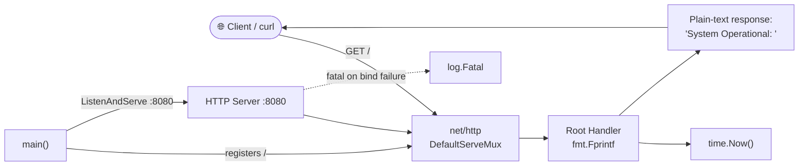
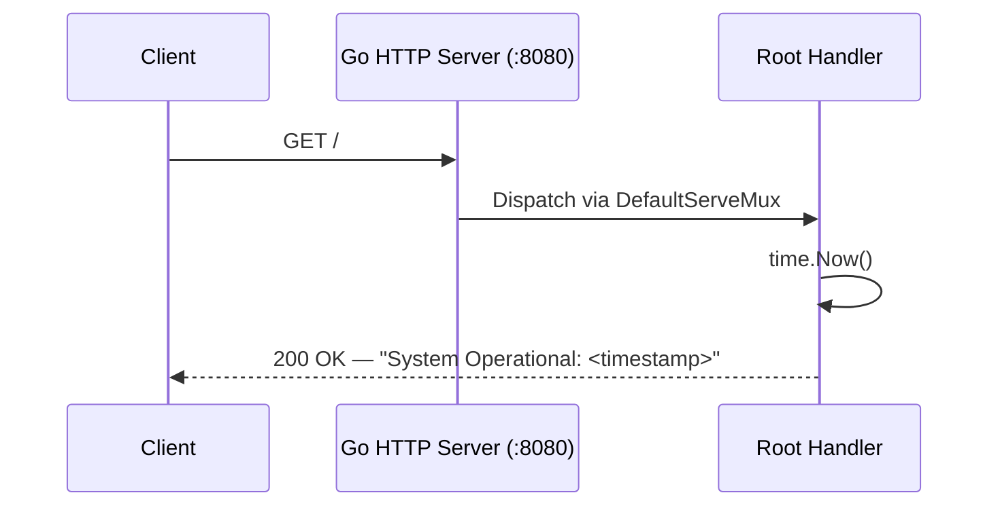
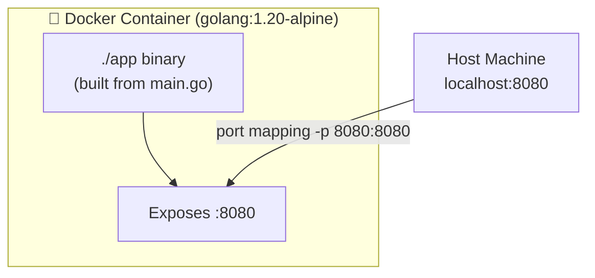
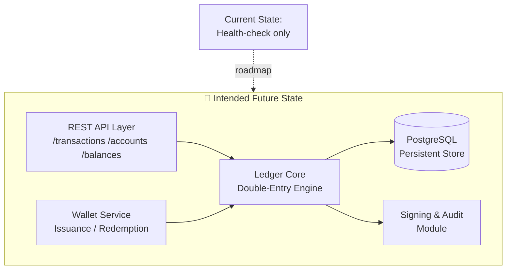

# Finance CBDC Ledger Prototype


> A minimal Go-based prototype service intended as a starting point for a Central Bank Digital Currency (CBDC) ledger system. Currently, the repository contains a single HTTP health-check endpoint and is **not** a functional ledger — see the [Workability Assessment](#️-workability-assessment) section for an honest evaluation.

---

## 📋 Overview

| Attribute | Detail |
|---|---|
| **Language** | Go 1.20 |
| **Module** | `github.com/Shivay00001/finance-cbdc-ledger-prototype` |
| **Dependencies** | None (standard library only) |
| **Entrypoint** | `main.go` |
| **Default Port** | `8080` |
| **Containerization** | Docker (single-stage Alpine build) |
| **License** | VisionQuantech Custom Commercial License (see [LICENSE](LICENSE)) |


---

## 🏗️ Architecture & How It Works

The current codebase is intentionally minimal. The entire application lives in `main.go` and works as follows:

1. **Startup** — The `main()` function registers a single HTTP handler on the root path (`/`) using Go's `net/http` default serve mux.
2. **Request Handling** — Any HTTP request to `/` receives a plain-text response:
   ```
   System Operational: 2026-01-01 12:00:00 ...
   ```
   The payload is the current server timestamp, functioning as a liveness/health probe.
3. **Server Lifecycle** — `http.ListenAndServe(":8080", nil)` starts the server on port **8080**. Startup and fatal errors are logged via the standard `log` package. If the server fails to bind, the process exits with a fatal log message.

### Component Diagram



### Request Lifecycle



### Container Topology



There are currently **no** ledger data structures, transaction models, account balances, double-entry bookkeeping logic, consensus mechanisms, cryptographic signing, or persistence layers implemented. The repository name describes the *intended* direction of the project.

---

## 🚀 Running Locally (Without Docker)

Requires Go 1.20+:

```bash
git clone https://github.com/Shivay00001/finance-cbdc-ledger-prototype.git
cd finance-cbdc-ledger-prototype
go build -o app
./app
```

Then verify:

```bash
curl http://localhost:8080/
# → System Operational: <timestamp>
```

---

## 🐳 Running with Docker

The included `Dockerfile` uses `golang:1.20-alpine`, copies the source, builds the binary, and runs it.

### Build and run

```bash
docker build -t finance-cbdc-ledger-prototype .
docker run -d -p 8080:8080 --name cbdc-ledger finance-cbdc-ledger-prototype
```

### Verify

```bash
curl http://localhost:8080/
```

### Optional: Docker Compose

No `docker-compose.yml` is shipped, but this minimal one works:

```yaml
version: "3.8"
services:
  ledger:
    build: .
    ports:
      - "8080:8080"
```

```bash
docker-compose up -d --build
```

---

## ⚖️ Workability Assessment

An honest evaluation of the current state:

**What works:**
- ✅ The code compiles cleanly with Go 1.20 and has zero external dependencies.
- ✅ The Dockerfile builds and the container runs the service correctly on port 8080.
- ✅ The HTTP health endpoint responds as expected.
- ✅ Sensible `.gitignore` hygiene for secrets and build artifacts.

**What is missing / limitations:**
- ❌ **No ledger functionality exists.** Despite the repository name, there are no accounts, transactions, balances, double-entry logic, or CBDC-specific features (issuance, redemption, wallets, cryptographic signing).
- ❌ **No tests** (`*_test.go` files are absent).
- ❌ **No persistence** — nothing is stored; all state is ephemeral (there is no state at all).
- ❌ **No configuration management** — the port is hardcoded; no environment-variable support.
- ❌ **No graceful shutdown** — the server does not handle `SIGTERM`/`SIGINT` for clean container stops.
- ❌ **No API surface** — a single unversioned root route returning plain text; no JSON, no structured errors.
- ❌ **Dockerfile could be hardened** — no multi-stage build (ships the full Go toolchain in the final image), runs as root, no `HEALTHCHECK` instruction.
- ❌ **No CI/CD, linting, or documentation of the intended ledger design.**

**Verdict:** This repository is a **scaffold / hello-world skeleton**, not a production-ready or even functionally complete CBDC ledger prototype. It is a valid starting point that compiles and deploys, but it requires **substantial implementation work** — domain models, transaction validation, persistence, security, and testing — before it delivers on its stated purpose.

### Target Architecture (Aspirational)



---

## 🗺️ Suggested Roadmap

1. Define core domain types: `Account`, `Transaction`, `Ledger` with double-entry invariants.
2. Add REST API endpoints (`POST /transactions`, `GET /accounts/{id}/balance`) with JSON responses.
3. Introduce persistence (e.g., PostgreSQL or an embedded store) with atomic balance updates.
4. Add cryptographic signing of transactions and audit logging.
5. Implement graceful shutdown, config via environment variables, and structured logging.
6. Add unit/integration tests and CI.
7. Harden the Dockerfile (multi-stage build, non-root user).

---

## 📄 License

This project is distributed under the **VisionQuantech Custom Commercial License**:

- **Free** for personal, educational, non-financial use.
- **Revenue share (15–30%)** required for individual earning use.
- **Commercial/enterprise use prohibited** without a separate license — contact **visionquantech@proton.me**.

See [LICENSE](LICENSE) for full terms. The software is provided **"AS IS"**, without warranty of any kind.